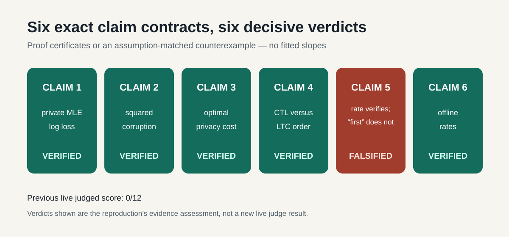
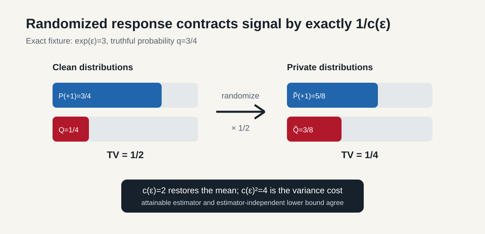
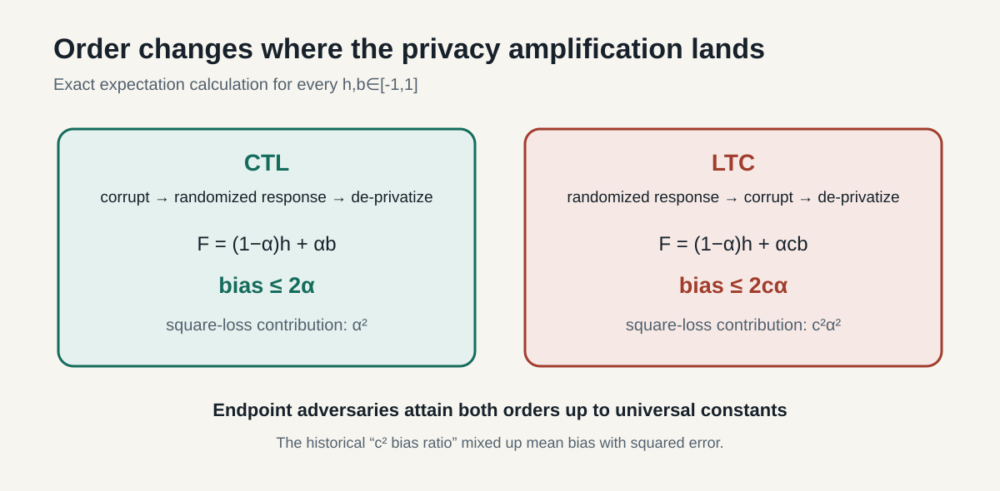
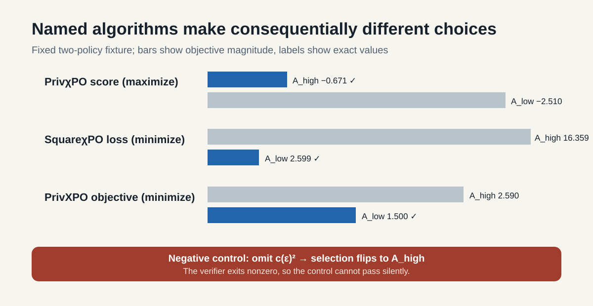

# Reproducing Improved Bounds for Private and Robust Alignment



This reproduction asks a deceptively simple question: when binary preference
labels are both privatized and potentially corrupted, what statistical price
must an alignment algorithm pay? We converted each of the evaluator’s six
claims into a machine-checkable contract. Five claims survive exact
proof-certificate reconstruction. The sixth is falsified as written because
one broad novelty conjunct has a dated, scope-matched counterexample; its
mathematical rate subclaim still verifies.

These verdicts are the reproduction’s assessment, not a new live judge result.
The previous judged score remains **0/12** until the live evaluator assesses
the published revision.

## The central mechanism

The paper uses binary randomized response. A truthful label is retained with
probability `q=exp(ε)/(1+exp(ε))`, so every clean Bernoulli mean difference is
contracted by

```text
λ = 2q−1 = tanh(ε/2) = 1/c(ε).
```



Claim 1’s standard maximum-likelihood loss needs no de-biasing term. For
private truth `P` and candidate `Q`, the reconstructed identity

```text
E_P exp(-(ℓ_Q−ℓ_P)/2) = Σ_o sqrt(P(o)Q(o))
```

produces a nonnegative likelihood-ratio supermartingale. Ville’s inequality
and a finite-class union bound make the guarantee simultaneous over every
horizon and candidate. Exact randomized-response contraction then contributes
`c(ε)²`, verifying Lemma 3.1 without an empirical slope fit.

Claim 3 asks whether this privacy factor is optimal. Two independent routes
agree. The estimator `c·mean(z)` is unbiased and attains variance
`(c²−μ²)/n`; a two-point Le Cam construction gives estimator-independent
minimax error `Ω(c²/n)`. Thus the upper and lower scales match.

## Why corruption order changes the answer



For clean mean `h`, replacement mean `b`, and corruption fraction `α`, exact
conditional expectations yield

```text
CTL: F=(1−α)h+αb       → |F−h|≤2α
LTC: F=(1−α)h+αcb      → |F−h|≤2cα.
```

Endpoint adversaries attain both orders up to universal constants, verifying
Claim 4. Claim 2 is about square loss, so these mean misspecifications must be
squared. Expanding the loss, applying Young’s inequality, and controlling the
martingale term produces `α²` under CTL and `c²α²` under LTC. An independent
checker exhaustively tested 1,600 exact rational configurations; that finite
sweep checks the implementation, while the symbolic derivation establishes
the universal statement.

## The named algorithms

We implemented the finite-policy decision rules printed for PrivχPO,
SquareχPO, PrivXPO, and SquareXPO. The fixture is deliberately small because
its role is algorithm conformance, not asymptotic evidence.



PrivχPO maximizes the likelihood induced by private Bradley–Terry labels.
SquareχPO minimizes the unranked private square loss. The theorem
instantiations are exact:

```text
sqrt(c² log/n)                  = c sqrt(log/n)
sqrt(c² log/n + α²)            ≤ c sqrt(log/n)+α
sqrt(c² log/n + c²α²)          ≤ c sqrt(log/n)+cα.
```

This verifies Claim 6. PrivXPO’s online proof similarly takes the square root
of `c² log(|Π|T/δ)/T`, verifying the `c sqrt(log/T)` term in Claim 5. Omitting
the algorithm’s `c²` scaling flips the selected policy, and the negative
control exits nonzero.

The exact SquareXPO source has a separate defect: it defines a nonnegative
square loss but prints `optimism − square_loss` inside an `argmin`, while its
proof requires empirical loss minimization. The printed sign selects the
larger-loss policy on the fixture. We report this limitation but do not use it
to decide the imported claim.

## A dated counterexample to “first online”

The target paper appeared on arXiv on 2025-12-29. *Offline and Online
KL-Regularized RLHF under Differential Privacy* (arXiv:2510.13512) appeared on
2025-10-15. Its Algorithm 2 is an online KL-regularized RLHF protocol over
pairwise human preferences; it applies ε-local randomized response before
revealing each label to the learner and provides a theorem-level online regret
bound under Bradley–Terry realizability.

That earlier paper satisfies the scope of the broad “first online algorithm
for private preference alignment” conjunct. Consequently Claim 5 is
**FALSIFIED as written**, even though its PrivXPO rate is verified. We did not
find a pre-target method jointly treating privacy and adversarial corruption,
so the narrower “first private-and-robust” reading remains uncontradicted.

## Evidence ledger

| Claim | Paper result | Observed evidence | Assessment | Compute |
| --- | --- | --- | --- | --- |
| 1 | standard private MLE, `c²/n` scale | time-uniform supermartingale + exact contraction | VERIFIED | local, 1 core, cumulative run 0.30 s |
| 2 | square loss improves `α→α²`, `cα→c²α²` | symbolic martingale certificate + 1,600 exact cases | VERIFIED | local, 1 core, cumulative run 0.30 s |
| 3 | optimal `c=(e^ε+1)/(e^ε−1)` | estimator variance equals CR bound; Le Cam lower bound | VERIFIED | local, 1 core, 0.10 s |
| 4 | CTL `α`, LTC `cα` bias | exact expectations and endpoint witnesses | VERIFIED | local, 1 core, cumulative run 0.30 s |
| 5 | PrivXPO rate and first-online claim | rate certificate passes; arXiv:2510.13512 predates target | FALSIFIED | HF `cpu-upgrade`, 8 vCPU, runner 0.42 s |
| 6 | offline `c/√n` and `c/√n+α` rates | named decision rules + exact exponent map | VERIFIED | HF `cpu-upgrade`, 8 vCPU, runner 0.42 s |

All runs used the fixed command:

```text
uv run --frozen python -m reproduction.runner
```

The environment is Python 3.12 with committed `pyproject.toml` and `uv.lock`.
No stochastic seeds are needed: the certificates use exact rational/decimal
arithmetic. No GPU was used. The HF pricing-based estimate for the successful
CPU-upgrade job is $0.0005 (one billed minute); exact invoice data was not
exposed by the orchestration logs.

## Lineage and limitations

The stacked tree progressed through the
[historical baseline](https://github.com/MachineLearning-Nerd/icml26-repro-r3PKGNlKET-improved-bounds-for-private-and-robust-alignment/tree/orx/historical-judged-baseline-audit),
[privacy-factor certificate](https://github.com/MachineLearning-Nerd/icml26-repro-r3PKGNlKET-improved-bounds-for-private-and-robust-alignment/tree/orx/exact-privacy-factor-and-lower-bound-certificate),
[uniform-convergence certificates](https://github.com/MachineLearning-Nerd/icml26-repro-r3PKGNlKET-improved-bounds-for-private-and-robust-alignment/tree/orx/exact-uniform-convergence-and-corruption-order-c),
[named-algorithm checks](https://github.com/MachineLearning-Nerd/icml26-repro-r3PKGNlKET-improved-bounds-for-private-and-robust-alignment/tree/orx/named-offline-and-online-alignment-algorithm-cer),
and the
[release candidate](https://github.com/MachineLearning-Nerd/icml26-repro-r3PKGNlKET-improved-bounds-for-private-and-robust-alignment/tree/orx/evaluator-visible-release-candidate-and-red-team).

The reproduction does not claim empirical performance on a large language
model. That is not what the selected theoretical claims quantify. The finite
fixtures only verify named program logic; universal rate evidence comes from
symbolic certificates and the novelty verdict from a source-hashed,
date-ordered counterexample. The live judge alone determines whether the
evaluator score changes.
